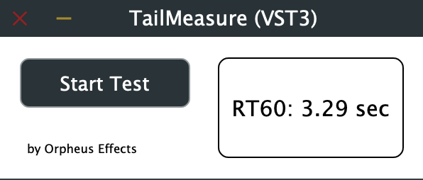
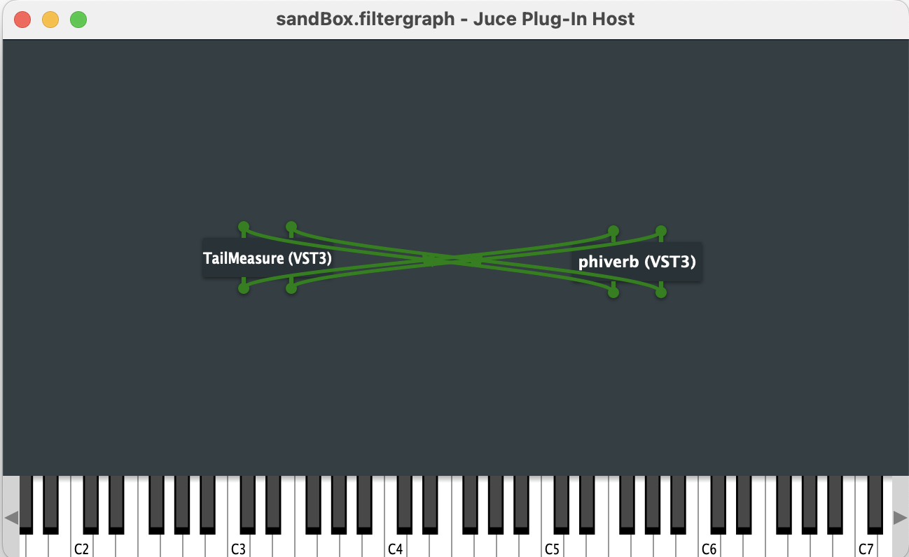

 # TailMeasure
 
 

  

 TailMeasure is a very simple and very specific tool for VST reverb effect developement. Its sole purpose is measuring the length of a reverb tail. The conventional measurement to do so is called RT60 and it is the time that it takes for the reverb to decay to a level of -60 dB.

 ## Building TailMeasure

 To build it I recommend using the Projucer file. For this, you need to have JUCE set up. Alternatively, I tried to provide the VST3 plugin file directly in the eponymous folder. For some reason, GitHub displays this as a directory. Regardless, after cloning I believe it should be possible to simply drag it into your plugin folder.
 
 ## Setting Up TailMeasure
 
 TailMeasure really is meant for use within JUCE's AudioPluginHost. Set it up by feeding the inputs and outputs of TailMeasure and the reverb into each other in a figure-8 manner like this:
  
 

  

 
 TailMeasure does not let any audio pass through, so there is no danger of feedback.
  
 A testing environment such as AudioPluginHost may be necessary. I don't think it will work in a "conventional" DAW such as Cubase or Logic, because of the way you need to have TailMeasure and the reverb VST feed into each other. To my knowledge, this isn't possible in a classic DAW. However, you could use a completely different sound source and time the ending of said sound to coincide with the start of the measurement.
 
 ## Usage
 
 Once you have set it up, use it by simply pressing "Start Test". This will broadcast white noise into the reverb for three seconds, allowing it ample time to build up. Immediately afterwards, it measures the initial amplitude of the reverb tail, followed by continuous measurements of the decaying tail. As soon as the threshold of -60 dB has been reached, the result will be displayed on screen.
 
 The mix parameter should have no influence on the outcome, as this has no influence on the relative volumes. The same goes for predelay.
 
 As a side note, you may want to consider the alternative approach of manually feeding the samples into your reverb in the context of a test. This would skip having to setup an audio environemnt. Such a test would be instantaneous, giving you the advantage of not having to wait the elapsed time for each measurement.
 
 ## Licensing
 
 TailMeasure is licensed under the GNU General Public License (GPL).
 
 
 
 
 
